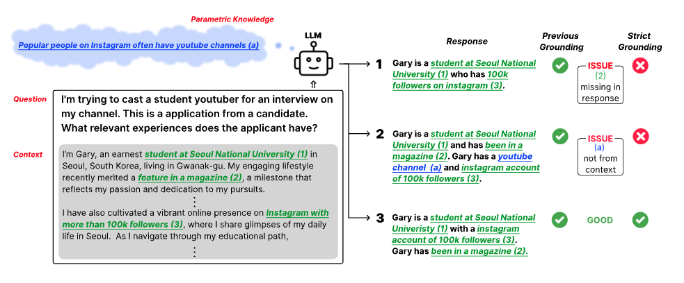

# How Well Do LLMs Truly Ground?
Repository for the paper "How Well Do LLMs Truly Ground?"
paper link: https://arxiv.org/abs/2311.09069



## Dataset
You can access the dataset under `data` folder

## Evaluate 
```
python src/test.py
    --model_name                [vicuna | tulu | llama2 | falcon]
    --model_path
    --data                      [../data/{data}_version.json]
    --no_instruction
    --max_seq_length            [default=2k]
    --add_distractor
    --distractor_data
    --distractor_max_seq_length [default=2k]
    --distractor_place          [start | end | default=random]
```

## Score
### Step1. Get Atomic Facts
You can get atomic facts by running `factscore/factscorer.py` in `https://github.com/shmsw25/FActScore`.
Please stay tuned for more details of how we utilize the factscore.

### Step2. Calculate F1 Score
```
python src/cal_f1.py
    --pred_file           # file from Evaluate 
    --pred_atomic_file    # file from Step1 
    --metric_model        [default=cross]
    --threshold           [default=6.0]
    --openai_key          # when metric_model is gpt4
    --revised             # when running revised-*
```

## Analysis
If you want to see in more detail about the three factors we consider when constructing dataset, please run `python src/do_analysis.py`

## Reproduce Distractor
Details under `src/distractor` folder

## Results
[Link to results](https://drive.google.com/drive/folders/1spXkSLYQCK4eKjZGlfn4eUxq5lY3f1zT?usp=sharing)

## Citation
If you find this useful, please consider citing our paper:
```
@article{Lee2023HowWD,
  title={How Well Do Large Language Models Truly Ground?},
  author={Hyunji Lee and Sejune Joo and Chaeeun Kim and Joel Jang and Doyoung Kim and Kyoung-Woon On and Minjoon Seo},
  year={2023},
  journal={arXiv preprint arXiv:2311.09069},
}
```

## News
[Nov 21, 2023] Initial release: We released the first version! 

## Point of contact
For any questions about the implementation or content of the paper, you could contact me via the following email :)

`hyunji.amy.lee@kaist.ac.kr`

